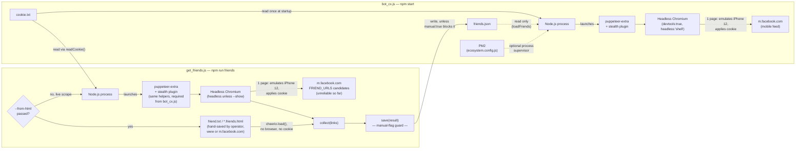
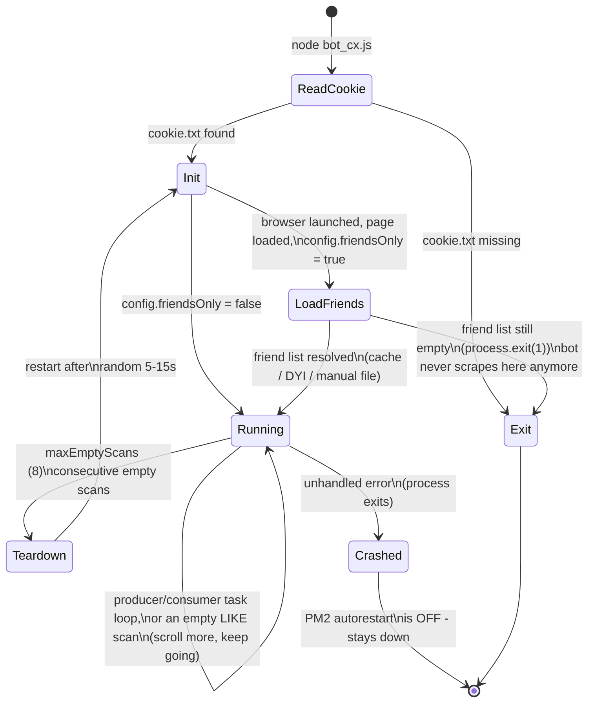
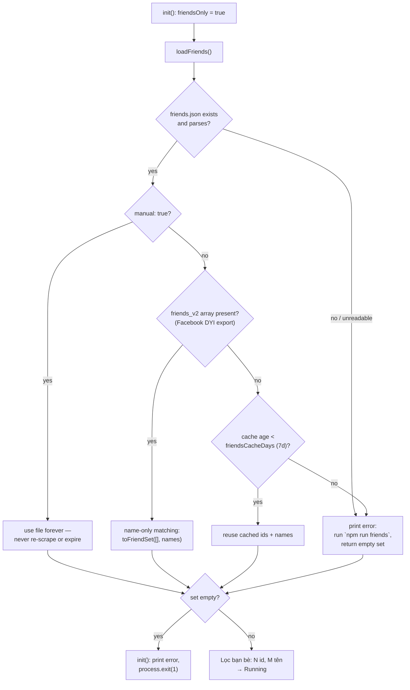
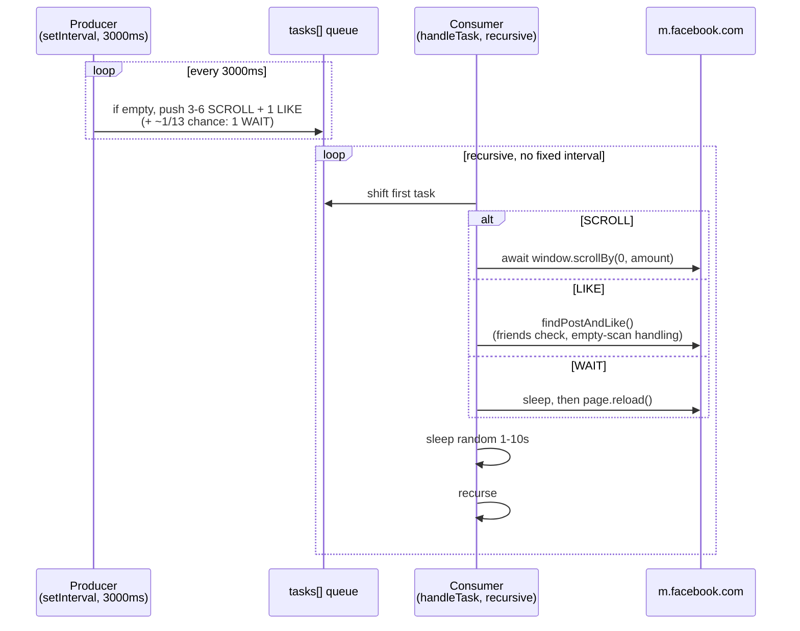
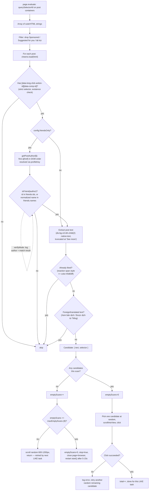

# System Architecture

> For the file/function inventory this document draws on, see
> [`codebase-summary.md`](./codebase-summary.md). For why the system is shaped this way,
> see [`project-overview-pdr.md`](./project-overview-pdr.md). For coding conventions,
> see [`code-standards.md`](./code-standards.md).

## Runtime topology

There are now **two independent Node.js processes**, run at different times, that never
share memory or a browser instance — only a file on disk (`friends.json`) connects them.
`bot_cx.js` (`npm start`) drives one browser, one page, one Facebook account, and never
scrapes the friend list itself anymore. `get_friends.js` (`npm run friends`) is a
separate, manually-invoked process, and it itself now has **two acquisition paths** that
both end up writing `friends.json` through the same `save()` helper: a live browser
scrape (still unreliable against a real account — see
[project-overview-pdr.md](./project-overview-pdr.md#constraints--risks)), and
`--from-html <file>`, which parses a friends-page HTML file the operator saved by hand,
with **no browser and no cookie at all** — currently the known-working path. Nothing in
this system is distributed, multi-tenant, or networked beyond the outbound connections to
Facebook (and the offline-parse path isn't networked at all). See
[Two-process operational model](#two-process-operational-model) below for why this is
split out.



Optional PM2 supervision wraps only the `bot_cx.js` process — it does not change the
topology, it only restarts/monitors it, and it has no relationship to `get_friends.js`,
which is always run by hand. See [PM2](#pm2) below.
```

Optional PM2 supervision wraps only the `bot_cx.js` process — it does not change the
topology, it only restarts/monitors it, and it has no relationship to `get_friends.js`,
which is always run by hand. See [PM2](#pm2) below.

## Process lifecycle / state machine



`friends.json` must already exist (or be a `manual`/fresh-enough cache) by the time
`LoadFriends` runs — there is no path in this diagram where the bot produces it itself.
If it's missing or stale, the operator runs `npm run friends` (see
[Friend-list lifecycle](#friend-list-lifecycle) below) and restarts `bot_cx.js`.

Key lifecycle facts, all verified against `bot_cx.js`:

- **Cookie gate**: `readCookie()` (`bot_cx.js:496-503`), called from the `require.main`
  entry-point guard (`bot_cx.js:507-512`) at module load, checks for `cookie.txt` and
  calls `process.exit(1)` immediately if it's absent — before any browser is launched.
  **Corrected in this version**: it previously called `process.exit(0)`, which wrongly
  signalled success on what is actually a startup failure. There is no retry, prompt, or
  fallback. The same `readCookie()` helper is shared with `get_friends.js`.
- **Init** (`fbJob.init`, `bot_cx.js:146-201`): launches Chromium, emulates an iPhone 12
  device profile, then re-applies a custom viewport (400x751 @1x), disables the
  navigation timeout entirely (`setDefaultNavigationTimeout(0)`), sets the cookie, and
  navigates to `https://m.facebook.com/` waiting for `networkidle0`.
- **Friend-list gate**: if `config.friendsOnly` is `true`, `init()` then calls
  `loadFriends()` and, if the resulting `{ids, names}` set is completely empty, prints an
  explanatory error and calls `process.exit(1)` (`bot_cx.js:189-200`) instead of starting
  the task loop. This code path is unchanged by the scraping extraction — what changed is
  *how often it's reached*: `loadFriends()` can no longer scrape its way out of an empty
  result, so a missing/stale `friends.json` now reaches this exit far more often (by
  design — see [Friend-list lifecycle](#friend-list-lifecycle) below).
- **Running**: `start()` (`bot_cx.js:403-447`) starts two concurrent async loops — a
  `setInterval` producer and a recursive `handleTask()` consumer — described in
  [Task queue design](#task-queue-design) below.
- **Empty-scan handling**: when `findPostAndLike()` finds zero like candidates, it does
  not tear the session down immediately. It increments `this.emptyScans`, and if that
  count is still below `config.maxEmptyScans` (default 8) it scrolls a random
  600-1200px to pull in more posts and returns, letting the next `LIKE` task retry
  (`bot_cx.js:352-361`). The counter resets to `0` on any scan that finds at least one
  candidate (`bot_cx.js:374`). Only once `maxEmptyScans` consecutive scans have found
  nothing does the bot fall through to the **full restart**: set `stop = true`, close the
  page and browser, and schedule a fresh `this.start()` after a random 5-15s delay
  (`bot_cx.js:362-371`). This is the only full self-recovery path in the system, and it
  is unrelated to the friend-list scraping extraction — it exists because with
  friends-only filtering on, most individual scans legitimately find nothing (the feed is
  mostly non-friends), and restarting on a single empty scan would thrash the browser
  session constantly.
- **Crash**: any *uncaught* exception (e.g., a Puppeteer call throwing outside the
  `try/catch` around the click in `findPostAndLike`, `bot_cx.js:386-399`) terminates the
  Node process. Because `ecosystem.config.js` sets `autorestart: false`, PM2 will **not**
  bring it back up — see [PM2](#pm2).
- **No graceful shutdown**: there is no `SIGINT`/`SIGTERM` handler; stopping the process
  (or `pm2 stop`) just kills it mid-task.

## Friend-list lifecycle

This is now split across the two processes described above. `bot_cx.js` only ever
*reads* `friends.json`, via `loadFriends()`, once from `init()`, before the task loop
starts — it has no scrape fallback left:



`friends.json` itself is produced by `get_friends.js` (`npm run friends`), which never
touches `bot_cx.js`'s browser or state. As of this version it has **two acquisition
paths**, chosen by whether `--from-html <file>` is passed, that both funnel through the
same `collect()` → `save()` helpers before anything is written:

```mermaid
flowchart TD
    T["npm run friends\n(get_friends.js)"] --> SW{"--from-html\npassed?"}

    SW -- yes --> HF["parseHtmlFile(file):\nverify file exists,\ncheerio.load() it —\nno browser, no cookie"]
    HF --> HL["extract every a[href] + text"]
    HL --> COL

    SW -- no, live scrape --> U["launch browser,\nemulate iPhone12,\napply cookie"]
    U --> V["for each FRIEND_URLS candidate,\nin order, until MIN_EXPECTED (5) profiles:"]
    V --> W["goto url,\nlog post-redirect URL"]
    W --> X["expandList(page):\nclick 'load more', scroll 3000px,\nwait 1.2-2.2s, up to 80 rounds,\nstop after 3 stable rounds"]
    X --> Y["harvest every a[href] + text"]
    Y --> COL["collect(links):\nresolve via profileKey,\ndedupe, keep first\nname-looking text"]

    COL --> Z{"result.ids.length >=\nMIN_EXPECTED (5)?\n(live-scrape path only)"}
    Z -- no --> AA["diagnose(): print pathname\ncounts + rejected sample hrefs,\nwrite debug_friends.html\n(--from-html: only under --debug)"]
    AA --> V
    Z -- yes, or --from-html --> SAVE["save(result)"]
    SAVE --> MG{"friends.json exists\nand manual: true?\n(skipped if --force)"}
    MG -- yes --> REFUSE["refuse to overwrite:\nprint count acquired,\n'KHÔNG lưu', point at --force,\nexit non-zero"]
    MG -- no / --force --> AB["write {at, ids, names}\nto friends.json"]
    AB --> AC["print 'People You May Know /\nnavigation-link contamination' warning"]
    V -- all URLs exhausted --> AD["exit non-zero:\nsend debug_friends.html +\ndiagnostics, or use --from-html"]
```

Notes:

- `loadFriends()`'s resolution order is deliberately "trust an explicit hand-edit first,
  then a known external format, then a time-bounded cache, then give up and tell the
  operator what to run" — see `loadFriends()` at `bot_cx.js:221-259`. There is no step 5;
  a miss here is always a hard stop, never a silent re-scrape.
- **Validated finding: the live-scrape path is still unreliable, the offline-parse path
  works.** `FRIEND_URLS` (`get_friends.js:30-35`) tries
  `https://m.facebook.com/friends/?target_pivot_link=friends` first (the URL that worked
  once before), then `/friends/list/`, `/friends/center/friends/` (the original,
  exclusively-tried URL — confirmed returning nothing), then `/me/friends` — but a
  further round of testing against the real account still came back empty. What did work:
  the operator saved the friends page's HTML by hand from **`www.facebook.com`
  (desktop)**, not `m.facebook.com`, and `parseHtmlFile()` parsed it without any code
  changes needed to `profileKey` — 838 `a[href]` → 288 unique profiles, all with names.
  That result was cross-validated by extracting the profile set implied by
  `/<user>/friends_mutual` links on the same saved page (232 entries) and confirming it's
  a strict subset of the 288 with zero missing — the extra 56 are presumed to be friends
  with no mutual friends (so no "bạn chung" link renders for them). See
  [project-overview-pdr.md](./project-overview-pdr.md#constraints--risks) for the full
  writeup and [Two-process operational model](#two-process-operational-model) below for
  why `--from-html` is the currently-recommended path.
- **Known limitation, still open**: whichever source is used — a live `FRIEND_URLS` page
  or a hand-saved HTML file — it may also contain a "Những người bạn có thể biết" (People
  You May Know) section or other navigation links, and no verified way exists yet to
  scope harvesting to only the actual friends list — the exact container selector needed
  has never been confirmed. The scrape/parse can therefore still pick up strangers.
  `save()` prints a loud console warning telling the operator to open `friends.json`,
  sanity-check the count against their real friend count, and hand-edit the file plus add
  `"manual": true` if it's wrong. See the operator-facing walkthrough in
  [README.md](../README.md#danh-sách-bạn-bè) and the risk entry in
  [project-overview-pdr.md](./project-overview-pdr.md#constraints--risks).

## Two-process operational model

The friend-list scraper used to be a method inside `bot_cx.js`, called automatically
from `init()`. It is now a standalone script, invoked by hand, that shares helpers with
the bot but never runs inside it. This split exists for one concrete reason:

**The friends-page DOM cannot be verified without a logged-in session.** Nobody but the
account owner can inspect what `m.facebook.com/friends/...` actually renders, so getting
the harvesting logic right is inherently a trial-and-error loop against a real account —
and the original in-bot version made every iteration of that loop expensive: change a
selector, restart the whole bot (relaunch Chromium, re-authenticate, re-navigate the
feed, wait through the task-producer's startup delay) just to find out whether the
friend-list scrape improved. When the operator reported the friends-center URL returning
nothing and pointed at a different working URL, that expensive loop is exactly what made
diagnosing and fixing it slow.

`get_friends.js` collapses that loop to seconds: `node get_friends.js --debug` launches,
scrapes, and exits on its own, with `diagnose()` printing exactly why a scrape came up
short (pathname histogram + rejected-href samples) so the next attempt can target the fix
directly — no bot restart, no feed navigation, no task queue to wait through.

The tradeoff this creates, and why it's acceptable: friend-list acquisition is no longer
a step inside the bot's startup, so **the bot will not maintain its own friend list**. It
purely reads whatever `friends.json` says. Operationally this means:

- `npm run friends` is a **prerequisite**, run once up front and again whenever the
  friend list needs refreshing (manually, or after `config.friendsCacheDays` makes the
  cached copy stale) — never triggered by `npm start` itself.
- A missing or stale `friends.json` is now always a **hard stop** (`process.exit(1)`)
  rather than something the bot silently works around by scraping — see
  [Friend-list lifecycle](#friend-list-lifecycle) above and the process-lifecycle diagram
  earlier on this page.
- The two processes are never running at the same time in normal operation: `npm run
  friends` completes and exits before `npm start` is run.

**A second split has since opened up inside `get_friends.js` itself, for the same
underlying reason.** Live scraping remains unsolved even after correcting the primary
URL — a further test round still came back empty. `--from-html <file>` sidesteps the
unverifiable-live-DOM problem entirely by working from a page the operator can see with
their own eyes before saving it: no browser, no cookie, no navigation timing to fight.
This is currently the **recommended** acquisition path, not a fallback — see the
"Validated finding" note in [Friend-list lifecycle](#friend-list-lifecycle) above. The
tradeoff is that it makes "refresh the friend list" a task with a manual step a human has
to perform correctly (open the page, scroll to the very bottom so everything renders,
save) rather than something either script can do unattended — see
[project-overview-pdr.md](./project-overview-pdr.md#constraints--risks) for that
constraint spelled out.

## Task queue design (producer/consumer)

The bot's "human-like" behavior is implemented as a tiny in-memory task queue, not a
scripted sequence. Two independent async loops share `this.tasks` (a plain array acting
as a FIFO queue):



Design notes:

- The producer (`bot_cx.js:410-443`) only ever pushes work when the queue is **empty**
  — it does not top it up continuously, so batch size (3-8 tasks) and cadence are
  self-limiting rather than unbounded.
- The consumer (`bot_cx.js:449-481`) is not driven by the producer's `setInterval`; it
  is a self-recursing `async` function that reschedules itself via a plain `Promise`
  chain (`this.handleTask().then()`), sleeping 1-10 real seconds between every task it
  processes — including empty-queue ticks, where it just sleeps and recurses.
- Both loops read/write the same `this.tasks` array with no locking. This is safe here
  only because Node.js is single-threaded and neither loop performs an `await` in the
  middle of a queue read-modify-write; if that ever changes, a race becomes possible.
- `scroll(amount)` (`bot_cx.js:293-298`) now correctly `await`s its in-page
  `page.evaluate` call; a prior version left that promise unawaited (documented as fixed
  in [codebase-summary.md](./codebase-summary.md#functions-and-methods-bot_cxjs)).
- `checkSlowNetwork()` (`bot_cx.js:483-493`) runs once per consumer iteration, before
  task dispatch, but only does real work the first time the loading banner is observed
  (`slowNetwork` flag makes it a no-op afterward).

## Like pipeline data flow

`findPostAndLike()` (`bot_cx.js:300-401`) is the only place page content is inspected in
depth. It intentionally moves heavy parsing **out of the page context** and into Node,
using cheerio, rather than doing DOM queries entirely inside `page.evaluate`. Friends-only
filtering is now the first content-based gate a post has to pass, ahead of the more
expensive text-extraction and already-liked checks:



Why this design is worth calling out:

- **Author identification is per-post, not per-surface.** `getPostAuthor` runs against
  whatever markup was captured for that post container — the same code path runs for a
  main-feed post, a group post, or a reel. A deliberate consequence: **a group post
  authored by a friend is still liked**, even though group posts are a different surface
  than the main feed. The filter matches on who wrote it, not where it appeared.
- **The friends check runs before text extraction**, not after, so a non-friend post
  never pays the cost of `div.bg-s3:nth-child(2) .native-text` extraction or the
  already-liked/foreign-language checks — those only run for posts that already passed
  the author check.
- Extraction happens once per `findPostAndLike()` call, over **whatever posts are
  currently rendered in the DOM** — there is no pagination/scroll-to-load loop inside
  this function; new posts only appear because prior SCROLL tasks (or the empty-scan
  scroll) already scrolled the feed.
- The random pick among candidates (`bot_cx.js:377-400`), rather than always the first
  match, is a deliberate detection-avoidance choice, consistent with the randomized
  SCROLL amounts and inter-task delays elsewhere.
- The "zero candidates" branch is the system's only feedback signal that the current
  page state is exhausted, but as of this version it no longer treats a single empty
  scan as exhaustion — see [Empty-scan handling](#process-lifecycle--state-machine)
  above for why that changed.

## PM2

`ecosystem.config.js` defines one PM2 app:

```js
{ name: 'bot_cx', script: 'bot_cx.js', instances: 1,
  autorestart: false, watch: false, time: true,
  env: { NODE_ENV: 'production' } }
```

- `instances: 1` — no clustering; running more than one instance against the same
  account/cookie is not supported by this code and would likely trigger Facebook
  anti-abuse detection faster.
- `autorestart: false` — PM2 will **not** restart the process if it crashes or exits.
  Combined with the in-app self-restart described above, this means: the app recovers
  itself from sustained "no like candidates," but not from a genuine crash (uncaught
  exception, OOM, cookie now invalid causing a Puppeteer error, etc.), and not from the
  empty-friend-list exit (`process.exit(1)`). Operators must monitor `pm2
  status`/`pm2 logs` to notice a stopped process.
- `watch: false` — file changes do not trigger a restart (appropriate; this is a
  long-running bot, not a dev server).
- `time: true` — PM2 prefixes log lines with timestamps, which is the only timestamping
  present anywhere in this system (the app's own `console.log` calls are not
  timestamped).

PM2 is optional — `npm start` (`node bot_cx.js`) runs the exact same code without PM2,
just without process supervision, log rotation, or timestamps.

## Deployment model

There is no containerization, no cloud infrastructure, and no remote deployment target
described anywhere in the repo. The intended deployment, per the current `README.md`, is
running the script directly on the same physical machine the account owner normally
browses Facebook from, specifically to make the traffic's originating IP/device profile
look consistent with normal personal usage rather than a datacenter or unfamiliar
location. See [project-overview-pdr.md](./project-overview-pdr.md#constraints--risks)
for the risk implications of that choice.
